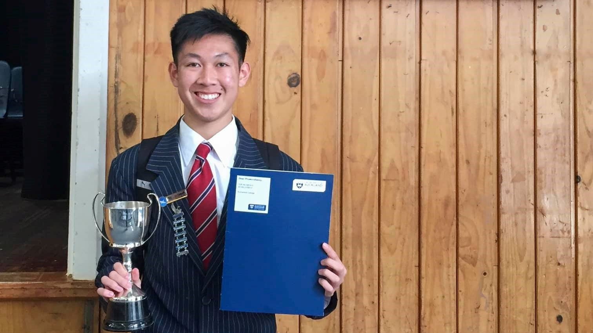

## About Me

Hello there! My name is Dean (call me Deano) and welcome to my first ever post on this Blog. In this post I'll be covering my Software Engineering journey leading up to here.

I'm currently a second year Engineering Student specialising in Software Engineering at the University of Auckland, New Zealand. My road up to choosing this career is bit of a jumpy one, which I didn't actually decide until half way through last year in first year general Engineering school (2020).

## So What Made Me Choose Software Engineering?

### High School

I was first exposed to programming and coding in high school. The subject was called "Computer Programming Technologies" which over my 3 senior years covered:

- HTML, CSS and vanilla JavaScript
- Python
- Basic computer science concepts (e.g. Algorithms)

I took this subject because I thought that whatever career I would adventure into the future, having a foundation of using computers would be helpful. Also a large part was that all my friends took the same subject and I liked the teacher. However I never intended to pursue a Computer Science/Software Engineerng career at the time. I was taking all the traditional subjects (Physics, Chemistry, Calculus and Economics) at the time without any focus towards anything, I wasn't even sure what I wanted to study at University.

### Choosing to do Engineering at University

Initially, I chose to do engineering because it lined up with all my subjects. Also my father was a mechanical engineer and I happened to see some of the work he did and thought it was cool and something I may want to go into.

Nothing special really happened in between, I applied/enrolled into the University's Engineering School, took my prerequisite exams and got accepted.

I was fortunate enough to get a scholarship for my first year at University which funded a year in catered residence halls and some funds to spend on *"University related costs"*.

Winning an award on my final day of high school

### First Year Engineering

It wasn't the most ideal start to my first year at University. This was the time when the COVID-19 Pandemic hit hard in New Zealand forcing a 6 weeking lockdown and meaning University was online for the whole semester. I was fortunate enough to have an environment that allowed me to continue studying and see out the first semester.

Crack on the second semester where things were starting to open up again and we were slowly progressing to the "new normal" being back on campus. However a few weeks into the semester another outbreak cause majority of the semester to be online again besides the last couple weeks. One of the courses I took was a coding course specific for Engineering purposes. This included learning programming languages such as:

- MATLAB (first half of semester)
- C (second half of semester)

It was here I really enjoyed the course and put my existing programming knowledge/skills into practice. Here is an example of one of the projects I did for the MATLAB section where we created a Julia Set Fractal Generator:

Julia Set Fractal Generator MATLAB Project

So it was during the duration of this course that I began to heavily consider pursuing a Software Engineering degree. It was really competitve to get into as the demand for it was really high and there was limited spots but after working hard and persevering I received a place in the cohort.

### Summer Internship

Over the summer, I worked as an intern an automation company where I undertook some general Engineering practice and essentially was exposed to the industry. I started off with some basic tasks that helped with my induction into the workplace including:

- Standardizing documentation
- Configuring AR technology and documenting manuals for use
- Filming and creating training and safety demonstration videos for product machinary

After being familiar with the procedures of the workplace, I was then introduced to a Research and Development project. Working in this project I was exposed to the whole JavaScript full-stack ecosystem which up to this day that experience was the biggest contributor to developing my skills in the industry.

I'll leave the details out, but the project involved a REST API backend and a React JS frontend integrated with a Postgres Database to automate an exisitng system of products that the company I worked for had. It also had to use an existing Web Software Developer Kit provided.

It was an overall great experience and learning opportunity, it gave me great assurance that picking Software Engineering as my career path was one that I would enjoy.

### Second Year Engineering

Besides a 2 week lockdown and online classes at the start of the semester, it was great to be back on campus for majority of the semester making new friends, meeting new people and participating in club activities.

Obviously starting the second year would be a big step up from first year engineering. The courses I took for the semester were:

- Object Oriented Programming/Design
- Software Engineering Theory (Discrete Mathematics)
- Mathematical Modelling
- Computer Systems Engineering Fundamentals

These were challenging but overall I got a lot out of them, they provided me the foundations for future courses and helped me develop my way of thinking and methods of coming up for solutions for problems a Software Engineer may face.

I am currently now half way through my second semester taking:

- Algorithms and Data Structures (Yikes!)
- Software Engineering Design
- Software Quality Assurance
- Professional Skills and Communication

I can't comment too much as I have not finished these courses yet, but so far I really am enjoying these courses and the challenge they provide.

### The Present and Final Thoughts

We have reached the present! Give yourself a pat on the back for making it this far!

I hope these experiences were relevant to you and gave you a bit of insight of my journey. Even better if they helped you!

As a reflection on my journey so far, I am glad that I chose to pursue a career in the Software Engineering and tech industry. I get to meet some incredibly bright people and enjoy what I do on a daily basis. I am looking forward to the future experiences and challenges I will encounter and updating my journey here!
